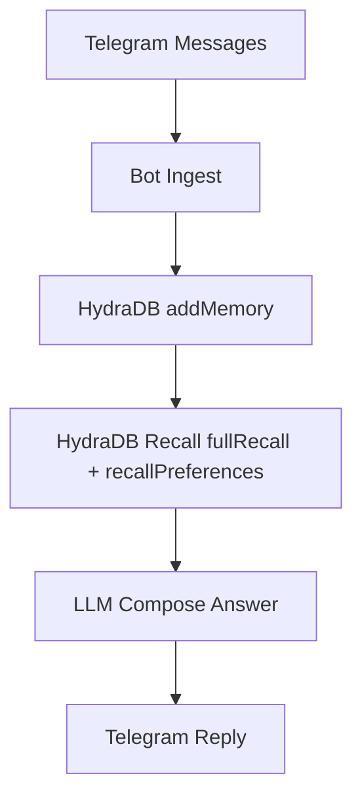

# contextio


Contextio is a multi-tenant memory layer for group conversations-turning every Telegram group into its own intelligent knowledge tenant. It auto-seeds historical chats, logs real-time messages, and builds a structured, queryable context layer per group tenant.

Powered by Hydra retrieval and LLM agents, Contextio doesn’t just answer questions-it understands intent, rewrites queries, performs multi-step retrieval, reranks signals, and returns precise, evidence-backed insights.

Each group tenant becomes a living knowledge system: track decisions, surface issues, extract action items, and maintain continuity across conversations. With commands like /issues, /actions, and /followup, users move from scattered chat noise to structured execution.

Contextio bridges the gap between communication and intelligence-transforming chaotic group chats into high-signal, memory-rich, decision-ready systems.

## Quick Run

```bash
npm install
cp .env.example .env
npm run seed:list-groups
npm run seed
npm run bot
```

Optional dashboard:

```bash
npm run dashboard
```

## Data Flow



## Detailed Doc

See [DETAILED.md](./DETAILED.md) for architecture, pipeline, scopes, and advanced usage.
